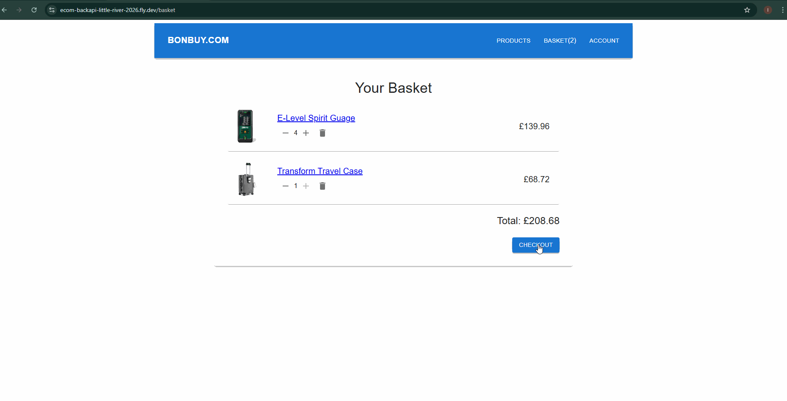

# Ecommerce Application

An end-to-end ecommerce platform built with a focus on backend development best practices, ensuring reliability, scalability, and maintainability.

## Description
This project demonstrates advanced backend development skills, including **transaction-safe stock management, asynchronous processing with task queues, secure authentication, and cloud-based storage solutions**. Built with a scalable architecture, it ensures **data consistency, fault tolerance, and high performance**.

## Features
- **User Authentication**: Secure authentication and session management.
- **Product Search**: Paginated and filtered searching, including categories and price ranges.
- **Persistent Basket**: Persistent user baskets, with real-time stock validation.
- **Stock Reservation & Validation**: Ensures accurate stock levels using MongoDB transactions.
- **Payment**: Integrated with PayPal for secure transactions.
- **Asynchronous Task Processing**: Uses BullMQ for background email notifications.
- **Scheduled Jobs**: Cron job releases stock from abandoned orders.
- **File Uploads & Storage**: Images handled via Multer, stored in Amazon S3, and served through CloudFront CDN.
- **API Validation**: Type-safe request validation using Zod and TypeScript.

## Tech Stack
- **Backend**: Node.js, Express, TypeScript
- **Database**: MongoDB with Mongoose
- **Queue & Jobs**: BullMQ, Redis, Cron Jobs
- **Payment Gateway**: PayPal SDK
- **File Storage**: Amazon S3, CloudFront CDN
- **Validation**: Zod & TypeScript
- **Email Delivery**: Nodemailer, Mailgun
- **Deployment**: Fly.io

## Frontend Demos:
### Registration and Product Search:

### Checkout and Stock Validation: 


## Installation
1. Clone the repository:
   ```sh
   git clone https://github.com/leburgeon/ecom-backapi.git
   ```

2. Install dependencies:
   ```sh
   cd ecom-backapi
   npm install
   ```

3. Set up environment variables (example in `.env.example`)

4. Start the development server:
   ```sh
   npm run dev
   ```

## Deployment
This project is deployed on **Fly.io**, ensuring scalable backend performance.

## Contact
For inquiries, reach out via GitHub issues or email.

---

This project showcases expertise in **backend development**, emphasizing **scalable architectures, database transactions, and cloud integrations** to ensure a robust ecommerce experience.
